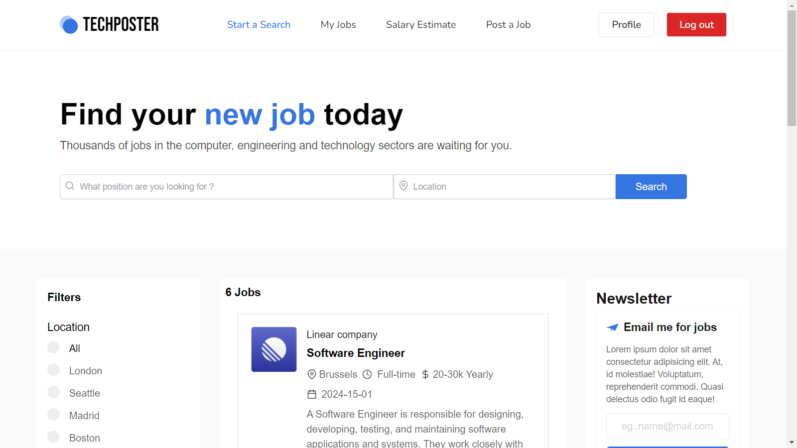
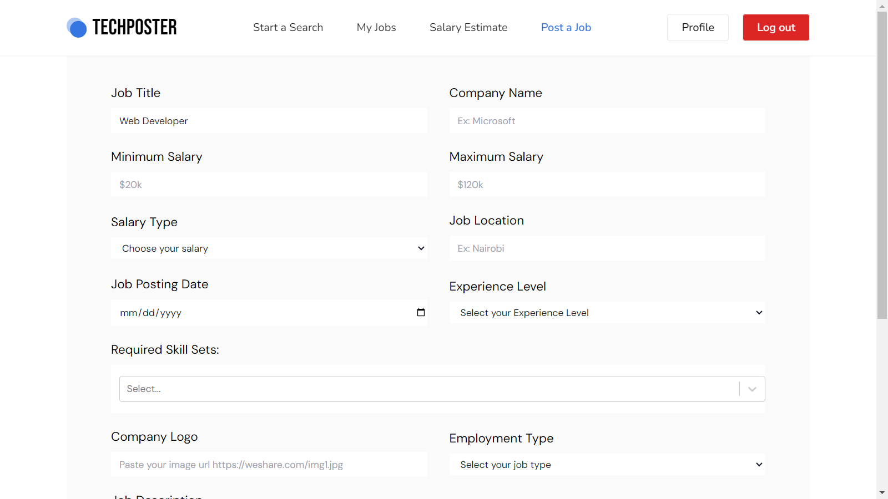
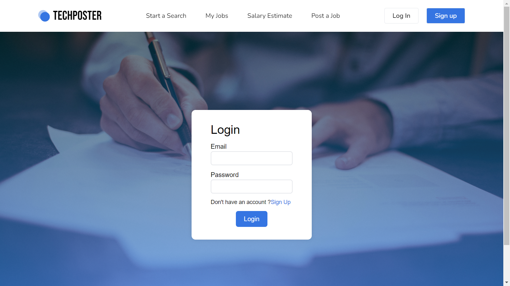
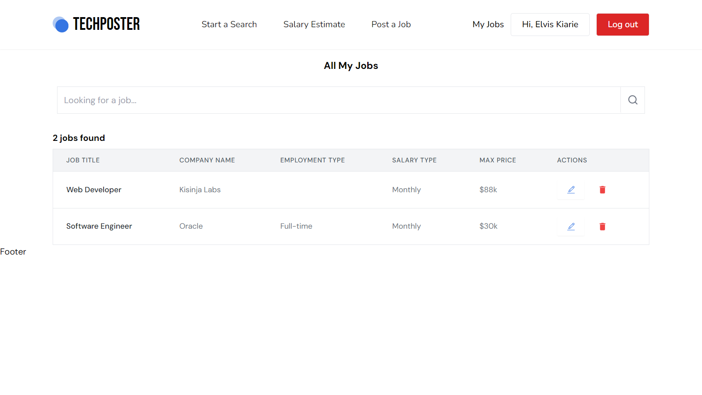
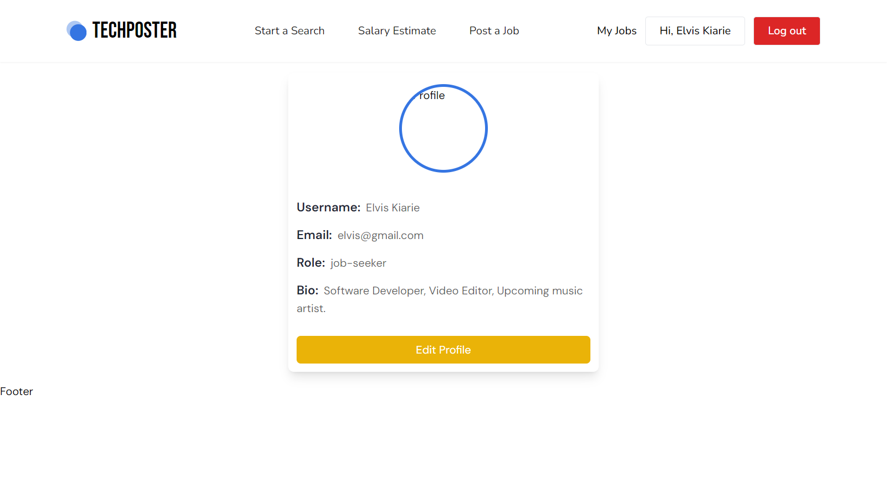

# TechPoster Website

A full-featured job posting website where employers can post job listings, and job seekers can browse and apply for jobs. This project is built using the MERN stack (MongoDB, Express.js, React.js, Node.js).

## Table of Contents
- [Features](#features)
- [Screenshots](#screenshots)
- [Installation](#installation)
- [Usage](#usage)
- [Technologies Used](#technologies-used)
- [Contributing](#contributing)
- [License](#license)

## Features
- User authentication and authorization (employer and job seeker roles)
- Post, edit, and delete job listings (employers)
- Browse and search for jobs (job seekers)
- Responsive design for mobile and desktop
- Admin panel to manage users and job posts

## Screenshots

### Job Listings


### Post Job


### SignUp 


### Login 


## My Jobs


## Profile


## Installation

1. Clone the repository:
   ```bash
   git clone https://github.com/kisinja/Job-Portal-Fullstack.git

Usage
Job Seekers: Sign up or log in, browse available jobs, and apply directly through the platform.
Employers: Sign up or log in, post new job listings, and manage your job posts through the employer dashboard.

Technologies Used
Frontend: React.js, Redux, Tailwind CSS
Backend: Node.js, Express.js, MongoDB
Authentication: JWT (JSON Web Tokens)
File Uploads: Multer


### Explanation:
1. **Title and Description**: A clear title and concise description introduce your project.
2. **Table of Contents**: Helps users quickly find the information they need.
3. **Features**: Highlights the key features of the job portal.
4. **Screenshots**: Provides visual context to what the website looks like. (Ensure you place actual screenshots in the `screenshots` folder within your project directory.)
5. **Installation**: Step-by-step instructions for setting up the project locally.
6. **Usage**: Explains how different types of users can interact with the website.
7. **Technologies Used**: Lists the tech stack and tools used in the project.
8. **Contributing**: Invites others to contribute and provides guidelines.
9. **License**: Specifies the license under which your project is distributed.

This format makes your README file well-organized, informative, and user-friendly.
